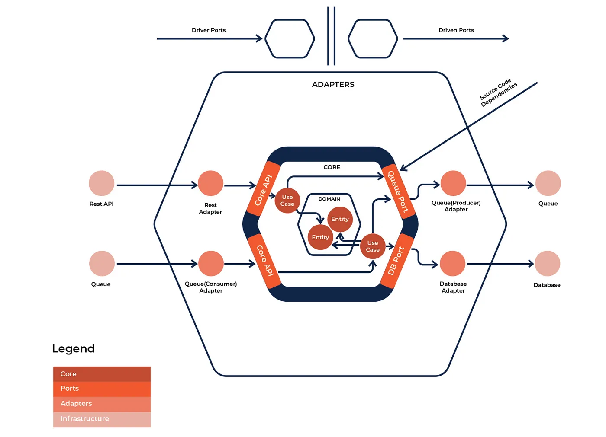
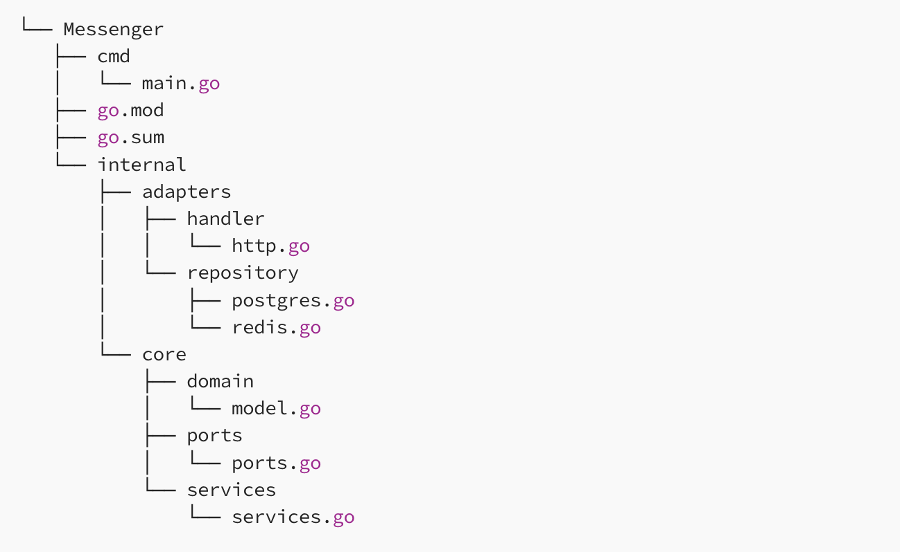

# 🌌 Hexagonal Architecture with Go - A Thorough Exploration of Backend Engineering

This is the source code for the original article:

[Hexagonal Architecture Deep Dive with PostgreSQL, Redis and Go Practices](https://medium.com/towardsdev/hexagonal-architecture-deep-dive-with-postgresql-redis-and-go-practices-4b051f940e93)

Note that the codebase has evolved with more complexity than the article's example. The article is just a starting point for the project.

## 🏡 What is Hexagonal Architecture?

Hexagonal Architecture, also known as Ports and Adapters Architecture or Clean Architecture, is a software architecture pattern that promotes loose coupling between the application core (business logic) and external components such as user interface, database, and external services.

In Hexagonal Architecture, the core of the application is isolated from external components and is instead accessed through a set of well-defined interfaces or ports. Adapters are then used to implement the required interfaces and integrate with the external components.

## 🔮 Hexagonal Architecture Components

Here are the components of the Hexagonal Architecture:

### 🎖 Core Business Logic:

The Core Business Logic is responsible for the main functionality of the application. This component represents the heart of the application and should be designed to be independent of any external dependencies. In Hexagonal Architecture, the Core Business Logic is implemented as a set of use cases that encapsulate the behavior of the application.

For example, if we are building a banking application, the Core Business Logic would include use cases such as creating an account, transferring funds, and checking account balance.

### 👯 Adapters:

The Adapters are responsible for connecting the Core Business Logic to the external world. Adapters can be of two types: Primary and Secondary.

#### 🕺 Primary Adapter:

The Primary Adapter is responsible for handling incoming requests from the external world and sending them to the Core Business Logic. In Hexagonal Architecture, the Primary Adapter is typically an HTTP server, which receives HTTP requests from clients and converts them into requests that can be understood by the Core Business Logic.

For example, in a banking application, the Primary Adapter would be an HTTP server that listens for incoming requests from clients, such as transferring funds or checking account balances, and then converts them into use cases that can be understood by the Core Business Logic.

#### 🥁 Secondary Adapters:

The Secondary Adapters are responsible for interfacing with external dependencies that the Core Business Logic relies on. These dependencies can be databases, message queues, or third-party APIs. Secondary Adapters implement the ports defined by the Core Business Logic.

In a banking application, the Secondary Adapters would include database adapters that interface with the Core Business Logic to store and retrieve data about accounts, transactions, and other related information.

### 😈 Interfaces:

In software architecture, an interface refers to a contract or an agreement between two software components. It defines a set of rules or protocols that a component must follow in order to communicate with another component.

In the context of hexagonal architecture, interfaces play a critical role as they define the boundaries of the core business logic and the adapters. The core business logic only interacts with the adapters through their interfaces. This allows for easy replacement of adapters without affecting the core business logic.

For example, let's say you have an online shopping application that needs to process payments. You can define an interface for the payment gateway adapter, which outlines the methods that the core business logic can use to interact with the payment gateway.

You can then have multiple payment gateway adapters that implement this interface, such as PayPal, Stripe, and Braintree. The core business logic only interacts with the payment gateway adapters through their defined interface, allowing for easy replacement or addition of payment gateways without affecting the core business logic.

### 👨‍👦‍👦 Dependencies:

These are the external libraries or services that the application depends on. They are managed by the adapters, and should not be directly accessed by the core business logic. This allows the core business logic to remain independent of any specific infrastructure or technology choices.

## 🤡 Application structure (to be updated)

Now, let's dive into how to create a messaging backend that allows users to save and read messages. Hexagonal architecture adheres to strict application layout that needs to be implemented. Below is the application layout that we will use. This might look like a lot of work, but it will make sense as we move forward.

# 👺 To-dos:

- ✅ Finish CRUD process of the messaging service
- ✅ REST API Design with Gin
- ✅ Add User service
- ✅ Add JWT Authentication and Authorisation
- ✅ Optimise error handling with clean code
- ✅ Add Webhook to update membership status (idempotent)
- ✅ Add a payment service
- ✅ Work with Stripe API
- ⌛️ Alter the whole project with Redis as cache, postgresql as database
- ⌛️ Add Unit Test
- ⌛️ Add Distributed services
- ⌛️ Add URL Queries

# 🚀 Pros and Cons of using GORM in this project

GORM is a popular Object-Relational Mapping (ORM) library for the Go programming language that provides a convenient way to interact with databases, including PostgreSQL.

It provides a high-level, expressive and easy-to-use API for CRUD (Create, Read, Update, Delete) operations and supports several databases, including MySQL, PostgreSQL, SQLite, and others.

Whether GORM is better to use than directly using PostgreSQL depends on the specific use case. If you need a high-level, user-friendly API to interact with your PostgreSQL database, then GORM can be a great choice. On the other hand, if you have specific requirements for your database interactions or need to optimize performance for a large-scale application, then direct interaction with the PostgreSQL database using a lower-level database driver may be more appropriate.

In general, the use of an ORM can simplify and speed up development, especially for CRUD operations. However, it may introduce additional overhead and performance concerns.

please show me step by step of how payment service can work with Stripe API based on the following payment structure of hexagonal architecture, no need to use code.

# 🧠 Thoughts on the Payment Service and Stripe API Integration

If you already have an API endpoint that interacts with the Stripe API, you may not need a payment service in the Hexagonal Architecture. However, if you want to store payment data in your local database for future reference or analysis, you can create a payment service to handle this.

To get the payment data from the Stripe API endpoint, you can use webhooks to receive events from Stripe when a payment is made. You can then parse the webhook data and store the relevant payment information in your local database.

Alternatively, if you are using Stripe's checkout feature, you can use the client_secret that is returned when you create a PaymentIntent to confirm the payment after it is made. Once the payment is confirmed, you can retrieve the payment data from Stripe using the PaymentIntent ID and store it in your local database.

Overall, the payment service in the Hexagonal Architecture would be responsible for storing and retrieving payment data from the local database, and potentially for processing payments and interacting with the Stripe API via webhooks or other methods.

# 🌈 The Stripe's Checkout and PaymentIntent Confusion

When you are working with Stripe API for the first time, you might be confused about the difference between Stripe's Checkout and PaymentIntent. This is because they are both used to accept payments, but they serve different purposes and have different capabilities.

Stripe's Checkout and PaymentIntent are both features that allow you to accept payments through Stripe, but they serve different purposes and have different capabilities.

Stripe Checkout is a pre-built payment page that handles the payment process on behalf of the merchant. It allows merchants to quickly and easily integrate a payment flow into their website without having to build their own payment form. Stripe Checkout also supports many payment methods, including credit and debit cards, Apple Pay, and Google Pay.

PaymentIntent, on the other hand, is a flexible API that allows merchants to create and manage payment transactions programmatically. With PaymentIntent, merchants have more control over the payment process, including the ability to handle complex payment scenarios, such as partial payments, deferred payments, and payments with multiple payment methods. In other words, the PaymentIntent API is a low-level API that allows you to create and manage payment transactions programmatically. It is not a pre-built payment form like Stripe Checkout.

In summary, Stripe Checkout is a pre-built payment form that makes it easy for merchants to get started with Stripe payments, while PaymentIntent provides a more flexible and powerful API for handling payment transactions programmatically.

# 👾 The Myths of Integration Testing and Unit Testing

In the context of software testing, integration testing and unit testing are two different types of tests that serve different purposes.

Unit testing focuses on testing individual units of code in isolation, typically at the function or method level. The goal of unit testing is to ensure that each unit of code works correctly on its own, without dependencies on other parts of the system. Unit tests are usually automated and can be run frequently as part of a continuous integration process.

Integration testing, on the other hand, tests the interactions and dependencies between different parts of the system. Integration tests may involve multiple units of code, subsystems, or external systems. The goal of integration testing is to ensure that all the pieces of the system work correctly together as a whole.

In the context of the hexagonal architecture, the unit tests would typically test the behavior of the core domain logic in isolation, while the integration tests would test the interactions and dependencies between the core logic and the adapters (such as the database or external APIs).

In the provided structure, the unit folder contains the user_service_test.go file, which likely contains tests for the UserService functions at the core level, testing their functionality in isolation from other parts of the system.

The integration folder contains the user_integration_test.go file, which likely contains tests that simulate the interaction between the UserService and the adapters, such as the UserRepository. These tests may use a real database or external API, and aim to test the behavior of the system as a whole.

# 🏃🏻‍♀️ How to Improve the Maximum TPS of the v1/payments API Service

To improve the maximum TPS (transactions per second) of the v1/payments API service, there are several strategies that can be employed:

### Optimize database queries:

One of the most common bottlenecks in a high-traffic API service is the database. By optimizing queries, indexing tables, and caching frequently-accessed data, the response time can be improved, leading to a higher TPS.

### Load balancing:

Distributing the incoming traffic across multiple servers can help increase the TPS of the API service. Load balancing can be done using hardware load balancers or software load balancers such as Nginx or HAProxy.

### Caching:

Caching frequently-accessed data can reduce the number of database queries required and improve the TPS. Memcached or Redis can be used for caching.

### Asynchronous processing:

By using asynchronous processing for time-consuming tasks, such as sending emails or processing images, the API service can handle more requests per second.

### Horizontal scaling:

Adding more servers to the server cluster can help increase the TPS. Kubernetes or Docker Swarm can be used for container orchestration to manage the scaling of the API service.

By implementing these strategies, the maximum TPS of the v1/payments API service can be improved.

# 🍕 Thoughts Collection on Recent Amazon Prime Video's Dump of its AWS Distributed Serverless Architecture and Move to “Monolith”

- The main scaling bottleneck in the architecture was the orchestration management that was implemented using AWS Step Functions. Our service performed multiple state transitions for every second of the stream, so we quickly reached account limits. Besides that, AWS Step Functions charges users per state transition. The second cost problem we discovered was about the way we were passing video frames (images) around different components. To reduce computationally expensive video conversion jobs, we built a microservice that splits videos into frames and temporarily uploads images to an… S3 bucket. Defect detectors (where each of them also runs as a separate microservice) then downloaded images and processed it concurrently using AWS Lambda. However, the high number of Tier-1 calls to the S3 bucket was expensive.

- To some observers, “the design in the PV [Prime Video] article is problematic. Misusing services doesn’t fix architecture issues, it exposes them” as Lambros Petrou, a senior software engineer at DataDog added on Twitter; a view to some degree shared by former CTO Steve Chambers, who said: “Basically, they now use the same architecture but condense components into containers so they don’t have expensive calls and data transfers across a network between different cloud services… it's kind of an obvious optimization!

- One engineer added in a Reddit debate on the shift: “Microservices have overhead. What used to be a simple inter-process communication or even an in-memory call between two small parts of a system becomes a full HTTPS, OAuth, JSON encoding/decoding exercise every time one of those short conversations needs to happen. When your system is blown apart into 500,000 pieces and each communication requires that setup, AND you’re being billed for each transaction, the cost and complexity adds up. The reaction against monoliths was the need to replace the entire application in one shot, meaning developers would actually need to test stuff. DevOps means there’s no more testing and we fail forward in production, and the only way you can do that is by having tiny functional pieces so you can find/fix stuff fast. I don’t think there’s anything wrong with saying these super-chatty parts of the application belong together without the need to open millions of connections all the time…”
